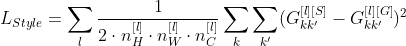

# Neural-Style-Transfer
Apply Gram matrix and pretrained VGG19 Convolutional Neural Network to analyze and draw a picture in given artistic styles.

# Description:
* Apply Gram matrix and pretrained kernels from VGG19 ConvNet to analyze the Style of the style image using Perceptual Loss and analyze the content in the main image using Texture Loss, and then combine those Losses to define the target of the optimization. Adaptive Momentum optimizer was used, as always, to optimize the image's pixels so that it minimizes the Loss function.
* For deeper details of the algorithm as well as the background math, please take a look at **Algorithm & Mathematics section** and refer to the research paper in the reference.
* If you want to try this algorithm yourself, please go to the link to my Google Colab, which is much more well-documented. Some basic knowledge in Python and Colab/Jupyter Notebook is required to run the algorithm effectively.

# Result:
Here are some results from this algorithm:  
**1) Scene (Paris)**

**Original Image:**  
   
**Art 1: Oil** 
   
**Result 1: Oil picture of Paris**  
   
**Art 2: Van Gogh** 
   
**Result 2: Paris by Van Gogh**  
   
**Art 3: Futurism**  
   
**Result 3: Futurism Paris**  
   

**2) Scene (New York)**

**Original Image:**  
   
**Art: Van Gogh**  
   
**Result: New York by Van Gogh**  
   

**3) Portrait (Taylor)**

**Original Image:**  
   
**Art: Art**  
   
**Result: Taylor portrait**  
   

# Algorithm and Mathematics:
* This algorithm relies on pretrained kernels of VGG19 CNN, the Gram matrix to analyze the style of each image, and the optimization on all pixels of the starting image (blank paper initially), which each pixels is the optimized parameter.
* VGG19 Kernels have been trained on ImageNet data set for regconition tasks, and they are useful for this algorithm due to their capability in feature extraction. If you are unfamiliar with the idea of how Kernels works, please refer to my repository "Visualizing Convolutional Neural Network". The pretrained kernels were used to analyze texture of the original image to produce important objects in the image using Content Loss, combined with Gram Matrix to reproduce the object in the origional image with the style of the artistic image.  

1) Texture Loss:
* Define the Loss so the the Neural Network can reproduce the original image with important features and without trivial details. For instance, in the Eiffel Towel scene above, the important objects are the tower, the sky, trees, etc, and trivial details are people and vehicles.
* Texture Loss for a specific layer l: 
  
  
* This is the Content Loss for activations of 1 layer in the Neural Network. The deeper the layer, the more abstract the generated image is (due to feature extraction and more condensed information in deeper layers). We want to avoid having the generated image which looks exactly like the content image, as it is NOT our main focus. 
* We DO NOT want the algorithm to be copy-paste! As a result, we should use deeper convolutional layers for more abstract information and **more room for creation and creativity**. In my algorithm, I used the activations in Block 4-Convolution 2 to define the loss function, as it is not too simple for the Neural Network to simply imitate the content image, nor too abstract so that the Neural Network can generate realistic images. Please feel free to modify the activation layers yourself to see what will happen if you move to shallower/deeper activations.
* About the formula, it is merely the L2 Loss between activations of content image the the generated image. Using this loss function for optimization will force the generated image to include important objects in the content image.
* The height, widgth, and depth of the activation (3D tensor) are included to normalize the effect of the activation size, as we want different L2 errors to have the same effect in the accumulated Content Loss function. For e.g, we dont want the activation with bigger size (which inheritedly has more elements in the tensor) to have more effect on the optimization.

2) Perceptual Loss:
* **The core of the algorithm**, defined by Gram matrices.
* Use to analyze the difference between the style of the artistic image and the generated image. Gram matrices are utilized to get the style of each matrix, and we again apply L2 loss between the Generated image's Gram matrix and the Artistic image's Gram matrix.
*  Gram matrix for 1 layer: 
 
 

* The math here might look very complicated at the first glance, but don't worry, it's actually a very simple idea! Just think of it as the dot product between 2 channels k and k' in the same activation layer l :) The Gram matrix is just the **matrix of dot products between 2 channels of the same layer**. If you wonder why there is a dot product between 2 matrices (2D vector), how about rolling that matrix into 1D vector? You can look at the original research paper for better clarification and visualization, if you are not really convinced.
* The intuition of Gram matrix is that the dot product measures how "different" each feature map is, hence measuring the style of the image.
* Now we have the formula to get 1 element in the gram matrix, but remember it only measure the difference between a SINGLE pair of channel in a SINGLE layer. Let's combine those elements to get the Gram matrices to define the complete Perceptual Loss (or Style Loss): 
 

* The formula means that in 1 layer, we are summing all the dot product of all possible permutations of any 2 channels in a specific layer l (yes, we allow duplicates so it's combinations, not permutations) to get the Gram matrix for layer l. In the code, I implemented this using rolling technique, roll the 3D tensor HxWxC into 2D matrix (HxW)xC and then multiply the matrix with its own transpose to get the Gram matrix.
* After that, we sum all the L2 Loss of Generated Image's Gram matrix and Style Image's Gram matrix across all channels to get the accumulated Perceptual/Style Loss.
* The layers for stylistic activations that I used are b1_conv1, b2_conv1, b3_conv1, b4_conv1, b5_conv1, all with equal weights.

* Final Loss:
 

* In my experiments, I first give the content more weights as we should first get the main structure of the image, and then give the style more weights to transfer the image to a particular style. I encourage you to experiment the weights (gamma1 and gamma2) yourself to see how it works.

# Reference:
@misc{gatys2015neural,
    title={A Neural Algorithm of Artistic Style},
    author={Leon A. Gatys and Alexander S. Ecker and Matthias Bethge},
    year={2015},
    eprint={1508.06576},
    archivePrefix={arXiv},
    primaryClass={cs.CV}
}
https://arxiv.org/abs/1508.06576

